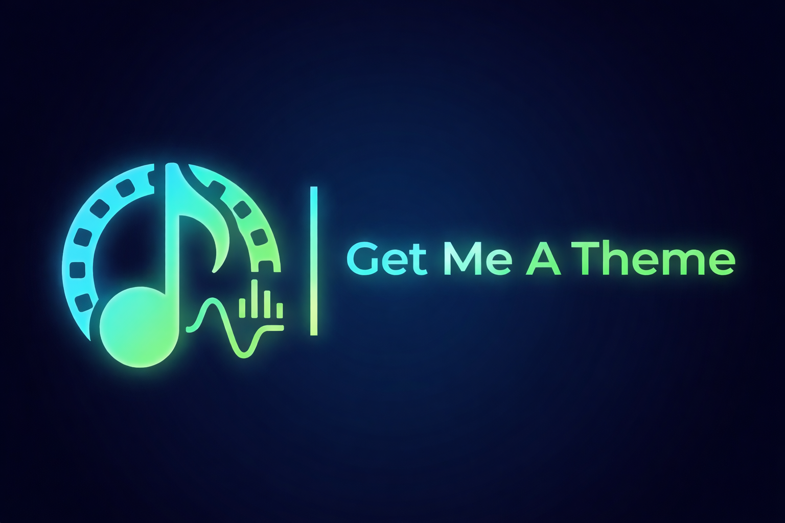

# Get Me A Theme 🎵

A fully automated, zero-maintenance tool that downloads high-quality theme songs for your local media libraries (Jellyfin, Plex, Emby, etc.). 

Available in a  **GUI App** for desktop users, or a **Lightweight CLI script** for Linux servers and NAS setups.

---

## 📦 Project Info
* **Version:** `v1.0.0`
* **License:** [MIT](LICENSE)
* **Security Check:** [Verified Clean on VirusTotal (2/72)](https://www.virustotal.com/gui/file/efe4a552303797e21e46dae3533b007c1cea73d233835049b7d3c48c293c10e6/) 🛡️

---

## 🌟 Key Features
* **Zero Maintenance Core:** The app automatically downloads and updates the latest `yt-dlp` scraping engine directly from GitHub. You never have to wait for plugin updates again.
* **Smart Name Cleaning:** Built-in regex that strips out pirate/scene tags (e.g., `1080p`, `WEBRip`) and locks onto release years to ensure highly accurate YouTube searches.
* **Interactive Fallback:** If automated search fails (due to YouTube age restrictions or region locks), the app pauses and allows you to paste a direct YouTube link for that specific movie.
* **Smart Cleanup:** Automatically detects and replaces empty (0-byte) `theme.mp3` files left behind by broken plugins.
* **Media Server Bug Fix:** Automatically generates a hidden `.ignore` file alongside the theme song to prevent media scanners from accidentally displaying the audio file as a movie.

---

## 🛠️ Step 1: Install FFmpeg (Required for all users)
To convert the downloaded audio into clean MP3s, your system needs **FFmpeg**. 

* **Windows Users:** * Open PowerShell as Administrator and run: `winget install ffmpeg`
  * *OR* download `ffmpeg.exe` manually, place it in a folder, and point the app to it later using the **"⚙️ Set FFmpeg"** button!
* **Linux Users:** Install via your package manager (e.g., `sudo apt update && sudo apt install ffmpeg`).

*(Note: You do NOT need to install `yt-dlp`. The app handles the core engine for you!)*

---

## 🎨 Option A: Using the GUI App (Windows Desktop)
Perfect for standard desktop users. No coding or terminal required!

1. Go to the **[Releases](../../releases)** page on this GitHub repository and download `Get Me A Theme.exe`.
2. Open the app and click the blue **"🔄 Update Core (yt-dlp)"** button to download the latest scraping engine.
3. Click **"➕ Add Folder"** to select your Movie and TV Show library directories.
4. *(Optional)* If FFmpeg isn't in your system PATH, click **"⚙️ Set FFmpeg"** and select the folder where your `ffmpeg.exe` lives.
5. Click **"🚀 START SCRAPING"** and watch the magic happen!

---

## 💻 Option B: Using the CLI Script (Linux / Servers / NAS)
Perfect for headless Linux servers, Unraid, or users who prefer the terminal. 
*Prerequisite: You must have Python 3 installed on your system.*

1. Download the `Get_Me_A_Theme_CLI.py` script from this repository.
2. Open it in a text editor (nano, vim, or Notepad) and update the `MEDIA_FOLDERS` list at the top.
   * **Example:** `MEDIA_FOLDERS = ["/mnt/user/movies", "/mnt/user/tv"]`
3. Run the script:
   *  `Get_Me_A_Theme_CLI.py`
   
4. The CLI will automatically download the required core engine for your OS and start scraping. It will prompt you in the terminal if it needs a manual YouTube link!

---

## 🛡️ Security & False Positives
"Get Me A Theme" is 100% open-source. You can verify the safety by reading `Get Me A Theme.py`.

**Note:** Because this is an independent project, Windows might show a "SmartScreen" warning. Click **"More Info"** -> **"Run Anyway"**. Some minor AI-based Anti-Virus engines may flag the tool; this is a common **False Positive** for Python apps. All major engines (Microsoft, Kaspersky, etc.) recognize the app as safe.

---

## 🎬 Step 3: Refresh Your Server
Once the scraping is completely finished, go to your media server dashboard (Jellyfin, Plex, Emby) and select **"Scan All Libraries"** (Replace all metadata) so the server recognizes your newly downloaded theme songs!

---

##  Built with AI
This project was developed using **Gemini** I am not a developer, but I needed a way to get automated theme songs in my Jellyfin server. This repository was created to fill that gap for myself and the community.

